# SOPilot System Architecture

**Last Updated:** 2026-02-08
**Version:** 0.1.0

---

## Table of Contents

1. [High-Level Overview](#high-level-overview)
2. [Component Architecture](#component-architecture)
3. [Data Flow](#data-flow)
4. [Queue Architecture](#queue-architecture)
5. [GPU Acceleration](#gpu-acceleration)
6. [Database Schema](#database-schema)
7. [File System Layout](#file-system-layout)
8. [Deployment Topology](#deployment-topology)

---

## High-Level Overview

SOPilot is a **video-based SOP evaluation system** that compares trainee performance against gold standard demonstrations using deep learning embeddings and dynamic time warping.

```mermaid
graph TB
    subgraph "Client Layer"
        UI[Web UI / Mobile App]
        API_Client[API Client]
    end

    subgraph "API Layer"
        FastAPI[FastAPI Server<br/>sopilot-api]
        Auth[Authentication<br/>Bearer/Basic]
        Metrics[Prometheus<br/>/metrics]
    end

    subgraph "Queue Layer"
        Redis[(Redis<br/>Queue Backend)]
        RQ_Ingest[RQ Worker<br/>Ingest Queue]
        RQ_Score[RQ Worker<br/>Score Queue]
        RQ_Train[RQ Worker<br/>Training Queue]
    end

    subgraph "Processing Layer"
        Ingest[Ingest Service<br/>Video → Embeddings]
        Scoring[Scoring Service<br/>DTW Alignment]
        Training[Training Service<br/>Feature Adapter]
        EmbedMgr[Embedding Manager<br/>V-JEPA2 / Heuristic]
    end

    subgraph "Storage Layer"
        SQLite[(SQLite<br/>Metadata DB)]
        FS_Raw[/data/raw/<br/>Video Files]
        FS_Embed[/data/embeddings/<br/>.npy Arrays]
        FS_Models[/data/models/<br/>Adapters]
        FS_Reports[/data/reports/<br/>PDFs/Exports]
    end

    subgraph "GPU Acceleration"
        VJEPA2[V-JEPA2<br/>PyTorch CUDA]
        DTW_GPU[DTW GPU<br/>CuPy]
    end

    UI --> FastAPI
    API_Client --> FastAPI
    FastAPI --> Auth
    FastAPI --> Metrics
    FastAPI --> Redis

    Redis --> RQ_Ingest
    Redis --> RQ_Score
    Redis --> RQ_Train

    RQ_Ingest --> Ingest
    RQ_Score --> Scoring
    RQ_Train --> Training

    Ingest --> EmbedMgr
    Scoring --> EmbedMgr
    Training --> EmbedMgr

    EmbedMgr --> VJEPA2
    Scoring --> DTW_GPU

    Ingest --> SQLite
    Scoring --> SQLite
    Training --> SQLite

    Ingest --> FS_Raw
    Ingest --> FS_Embed
    Scoring --> FS_Reports
    Training --> FS_Models

    EmbedMgr --> FS_Models
    EmbedMgr --> FS_Embed
```

**Key Characteristics:**
- **Asynchronous Job Processing:** Redis Queue (RQ) for background tasks
- **GPU Accelerated:** V-JEPA2 (PyTorch) + DTW (CuPy) for 10-100x speedup
- **Modular Services:** Separation of concerns (ingest, scoring, training, audit)
- **Dual Embedder Support:** V-JEPA2 (research-grade) + Heuristic (lightweight fallback)

---

## Component Architecture

### 1. API Server (`sopilot-api`)

**Entry Point:** `src/sopilot/api.py`

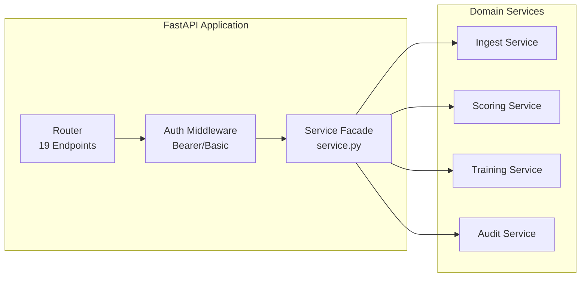

**Responsibilities:**
- HTTP request handling (REST endpoints)
- Authentication/authorization (role-based: admin/operator/viewer)
- Job enqueuing (delegate to workers)
- Status polling (job completion tracking)
- File serving (videos, PDFs, exports)

**Key Files:**
- `api.py` (268 lines) - Thin facade, delegates to services
- `schemas.py` - Pydantic v2 models for request/response validation
- `config.py` - Settings with validation (76+ env vars)

---

### 2. Queue Workers (`sopilot-worker`)

**Entry Point:** `src/sopilot/cli/worker.py`

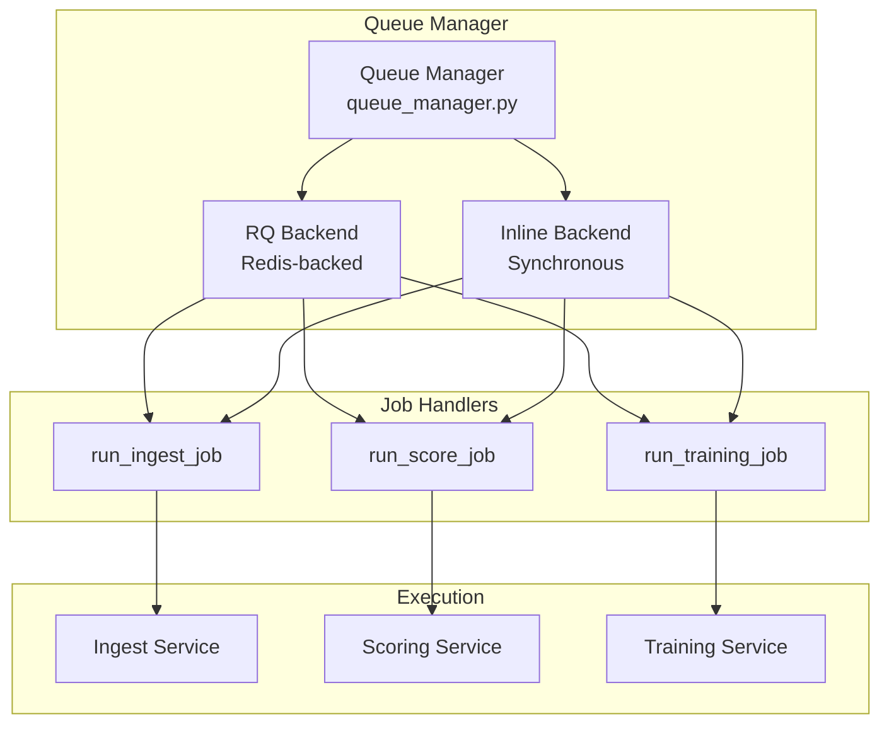

**Queue Types:**
- **`sopilot_ingest`:** Video processing (embeddings generation)
- **`sopilot_score`:** DTW alignment scoring
- **`sopilot_training`:** Feature adapter training + reindexing

**Backends:**
- **RQ (Production):** Async, distributed, failure recovery
- **Inline (Testing):** Synchronous, single-process, immediate execution

---

### 3. Watch Folder Daemon (`sopilot-watch`)

**Entry Point:** `src/sopilot/cli/watch.py`

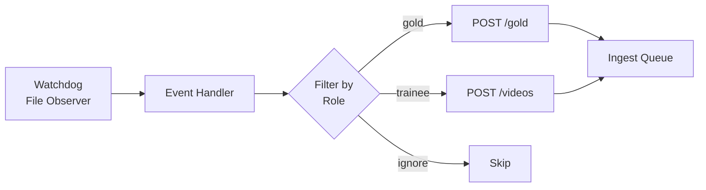

**Responsibilities:**
- Monitor `SOPILOT_WATCH_FOLDER` for new video files
- Auto-categorize by filename pattern (e.g., `*_gold.mp4`, `*_trainee.mp4`)
- Enqueue ingest jobs via API

**Configuration:**
- `SOPILOT_WATCH_FOLDER=/data/watch`
- `SOPILOT_WATCH_GOLD_PATTERN=*_gold.*`
- `SOPILOT_WATCH_TRAINEE_PATTERN=*_trainee.*`

---

## Data Flow

### Ingest Pipeline

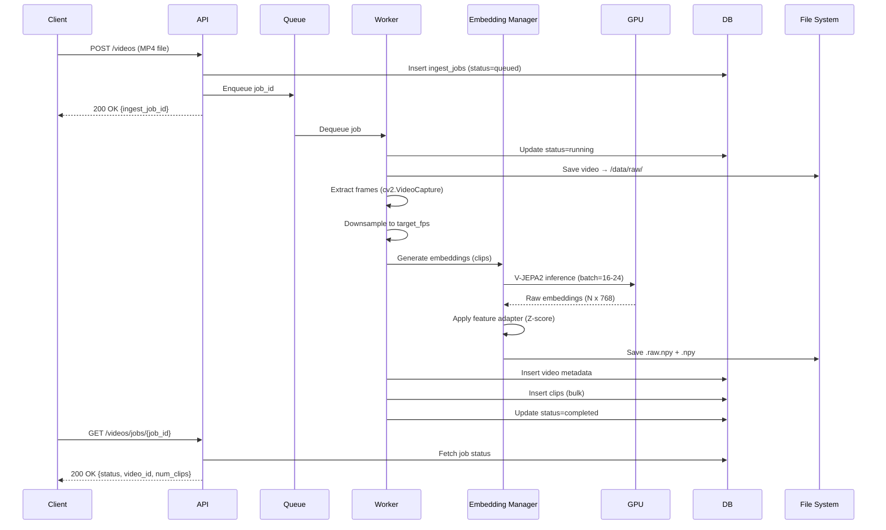

**Key Steps:**
1. **Upload:** Client sends MP4 via multipart/form-data
2. **Validation:** Check file size (<`UPLOAD_MAX_MB`), task_id format
3. **Frame Extraction:** OpenCV VideoCapture, downsample to `target_fps`
4. **Embedding Generation:** V-JEPA2 (GPU) or Heuristic (CPU fallback)
5. **Feature Adaptation:** Apply learned Z-score normalization
6. **Persistence:** SQLite (metadata) + NumPy files (embeddings)
7. **Indexing:** Bulk insert clips for search

**Performance:**
- 10s video @ 30fps → 75 clips @ 4fps
- V-JEPA2 (RTX 5090, batch=16): ~0.5s embedding time
- Total pipeline: ~2-5s (dominated by frame extraction)

---

### Scoring Pipeline

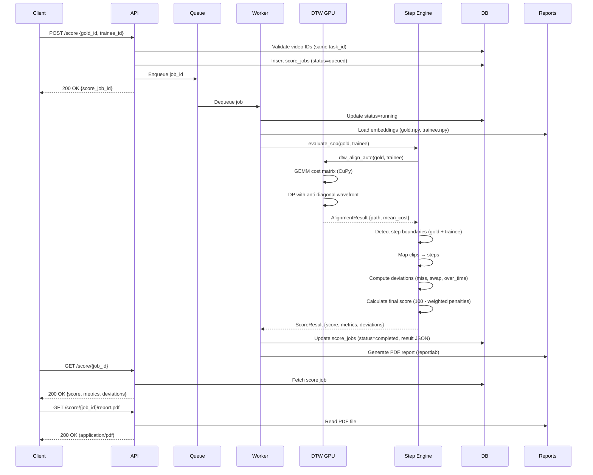

**Key Algorithms:**
1. **DTW Alignment:** O(m*n) dynamic programming, GPU-accelerated
   - Cost matrix: `1 - cosine_similarity(gold, trainee)`
   - Path recovery: Backtrack from (m, n) to (0, 0)
   - GPU speedup: 10-30x (2-3s → 0.1-0.3s for 2000x2000)

2. **Step Boundary Detection:** Change-point analysis
   - Compute pairwise distances between consecutive clips
   - Threshold: `mean + threshold_factor * std`
   - Insert boundaries where distance > threshold

3. **Deviation Detection:**
   - **Missing Steps:** Gold step with no aligned trainee clips
   - **Swapped Steps:** Trainee performs step X when gold shows step Y
   - **Over Time:** Trainee takes >10% longer than gold for a step
   - **Temporal Warp:** Large `path_stretch` (DTW path deviation from diagonal)

4. **Scoring Formula:**
   ```
   score = 100.0 - (
       miss_penalty * num_misses +
       swap_penalty * num_swaps +
       deviation_penalty * avg_deviation +
       over_time_penalty * over_time_ratio +
       temporal_warp_penalty * temporal_warp +
       ...  # 15+ metrics total
   )
   score = max(0.0, min(100.0, score))
   ```

---

### Training Pipeline

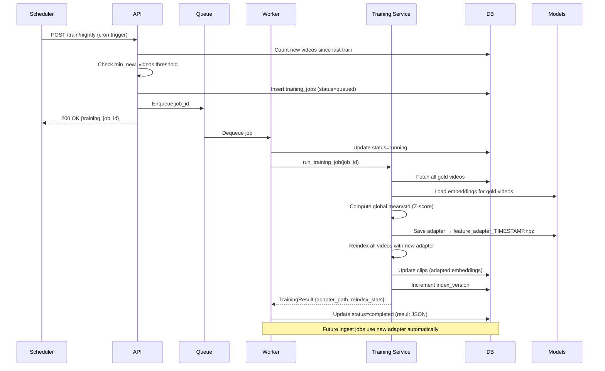

**Feature Adaptation:**
- **Goal:** Normalize embeddings for better DTW alignment
- **Method:** Z-score normalization per dimension
  - `adapted = (raw - mean) / std`
  - Computed from **gold videos only** (domain experts)
- **Storage:** `.npz` file with `{mean, std}` arrays
- **Reindexing:** Apply adapter to all existing videos (backward compatibility)

**Training Triggers:**
1. **Nightly Scheduler:** Cron at `SOPILOT_TRAINING_HOUR` (default: 2 AM)
2. **Manual API:** `POST /train/nightly` (admin role)
3. **Threshold:** Only run if `new_videos >= SOPILOT_TRAINING_MIN_NEW_VIDEOS`

---

## Queue Architecture

### Job Lifecycle

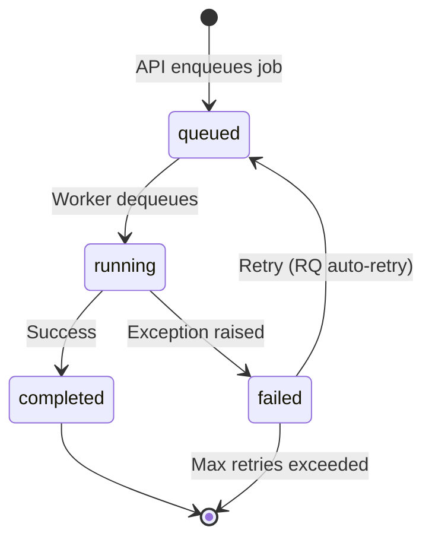

### RQ Configuration

**Queues:**
| Queue Name | Priority | Typical Workload | Timeout |
|------------|----------|------------------|---------|
| `sopilot_ingest` | Normal | 2-10s per video | 600s |
| `sopilot_score` | High | 1-30s per score | 300s |
| `sopilot_training` | Low | 5-20min per train | 3600s |

**Worker Pool:**
- **Development:** 1 worker per queue (3 total)
- **Production:** 4-8 workers per queue (auto-scaling based on queue depth)
- **GPU Workers:** Dedicated pool with CUDA access (V-JEPA2 + DTW GPU)

**Failure Handling:**
- **Max Retries:** 3 (configurable per job type)
- **Exponential Backoff:** 60s, 300s, 900s
- **Dead Letter Queue:** Failed jobs moved to `sopilot_failed`
- **Monitoring:** Prometheus metrics for queue depth, failure rate

---

## GPU Acceleration

### V-JEPA2 Optimization

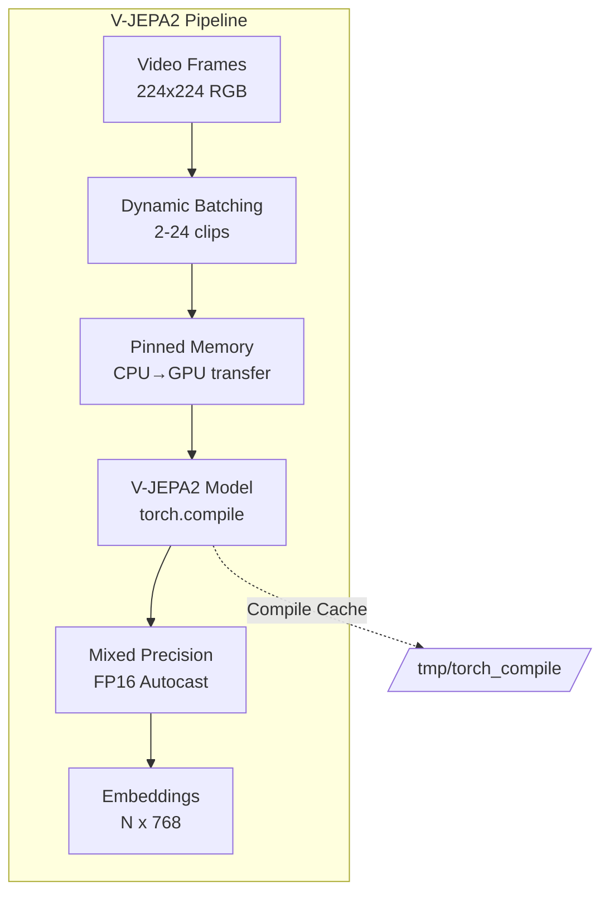

**Batch Size Selection:**
| GPU Model | ViT-Large | ViT-Huge | ViT-Giant |
|-----------|-----------|----------|-----------|
| RTX 5090 (32GB) | 16-24 | 8-12 | 4-8 |
| A100 (40GB) | 20-30 | 10-16 | 6-10 |
| T4 (16GB) | 8-12 | 4-6 | 2-4 |

**Performance Gains:**
- **torch.compile:** 20-30% speedup (reduce-overhead mode)
- **Pinned Memory:** 10-15% faster transfers
- **Dynamic Batching:** 3-6x throughput (batch=2 → batch=16-24)
- **Total Speedup:** ~4-8x vs baseline

---

### DTW GPU Acceleration

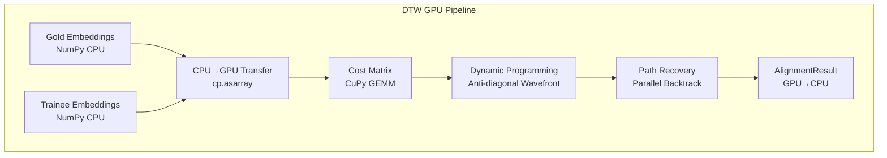

**Algorithm:**
1. **Cost Matrix:** `cost = 1 - (gold @ trainee.T)` (cosine distance)
   - CuPy GEMM: ~100x faster than NumPy on large matrices
2. **DP Computation:** Anti-diagonal wavefront iteration
   - Vectorize `d = i + j` diagonals
   - Parallel update: `dp[i, j] = min(dp[i-1,j], dp[i,j-1], dp[i-1,j-1]) + cost[i,j]`
3. **Path Recovery:** Backtrack from (m, n) to (0, 0)

**Performance:**
| Matrix Size | CPU (NumPy) | GPU (CuPy) | Speedup |
|-------------|-------------|------------|---------|
| 100 x 100 | 12 ms | 2 ms | 6x |
| 500 x 500 | 180 ms | 15 ms | 12x |
| 1000 x 1000 | 720 ms | 45 ms | 16x |
| 2000 x 2000 | 2800 ms | 120 ms | 23x |

**Fallback Strategy:**
```python
def dtw_align_auto(gold, trainee, prefer_gpu=True):
    if prefer_gpu and is_gpu_available():
        try:
            return _dtw_align_gpu(gold, trainee)
        except Exception as e:
            logger.warning(f"GPU DTW failed: {e}, falling back to CPU")
    return dtw_align(gold, trainee)  # CPU fallback
```

---

## Database Schema

### Entity-Relationship Diagram

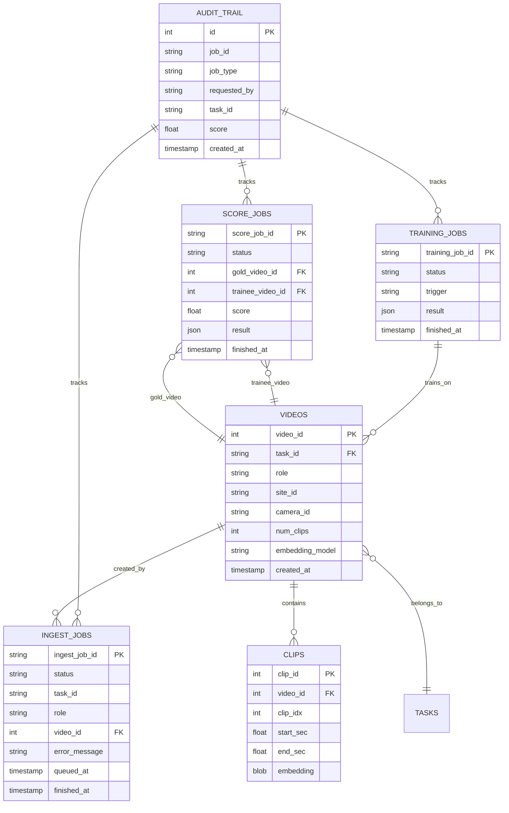

### Key Tables

**`videos`** (8 columns):
- Primary storage for video metadata
- `role` ∈ {gold, trainee} determines usage
- `embedding_model` tracks V-JEPA2 version

**`clips`** (6 columns):
- Time-series embeddings (1 row per clip)
- `embedding` stored as BLOB (NumPy pickled array)
- Indexed by `(video_id, clip_idx)` for fast lookup

**`ingest_jobs`** / **`score_jobs`** / **`training_jobs`**:
- Job status tracking (queued → running → completed/failed)
- `result` column stores JSON output (ScoreResult, TrainingResult)
- TTL: Configurable cleanup after N days

**`audit_trail`**:
- Immutable append-only log
- HMAC-signed exports for compliance
- Indexed by `created_at` for time-range queries

---

## File System Layout

```
/data/
├── raw/                          # Original uploaded videos
│   ├── video_1.mp4
│   ├── video_2.mp4
│   └── ...
│
├── embeddings/                   # NumPy embedding arrays
│   ├── video_1.raw.npy           # Pre-adaptation embeddings
│   ├── video_1.npy               # Post-adaptation embeddings
│   ├── video_1.json              # Metadata (fps, duration, model)
│   └── ...
│
├── models/                       # Feature adapters
│   ├── feature_adapter_train_20260208_120000.npz
│   ├── feature_adapter_train_20260207_020000.npz
│   └── ...
│
├── reports/                      # Generated PDFs/exports
│   ├── score_20260208_120000_abc123.pdf
│   ├── audit_export_20260208_120000.json
│   └── ...
│
├── watch/                        # Watch folder daemon
│   ├── gold/                     # Auto-categorized gold videos
│   ├── trainee/                  # Auto-categorized trainee videos
│   └── processed/                # Moved after ingest
│
└── logs/                         # Application logs
    ├── sopilot-api.log
    ├── sopilot-worker.log
    └── sopilot-watch.log
```

**Storage Estimates:**
- **Raw Video:** ~10-50 MB per 30s video (H.264 compressed)
- **Embeddings:** ~300 KB per video (75 clips × 768 dims × 4 bytes)
- **Models:** ~6 KB per adapter (768 × 2 arrays × 4 bytes)
- **Database:** ~1 MB per 1000 videos (metadata only)

**Disk Usage (1000 videos):**
- Raw: ~30 GB
- Embeddings: ~300 MB
- Models: ~50 KB (versioned)
- Total: ~30.3 GB

---

## Deployment Topology

### Single-Node Deployment

```mermaid
graph TB
    subgraph "Docker Host (RTX 5090)"
        API[sopilot-api<br/>Port 8000]
        Worker1[sopilot-worker<br/>Ingest + Score]
        Worker2[sopilot-worker<br/>Training]
        Watch[sopilot-watch<br/>Optional]
        Redis[Redis<br/>Port 6379]

        API --> Redis
        Worker1 --> Redis
        Worker2 --> Redis
    end

    subgraph "Storage"
        Volume[/data/<br/>Bind Mount]
    end

    subgraph "Monitoring"
        Prometheus[Prometheus<br/>Port 9090]
        Grafana[Grafana<br/>Port 3000]
    end

    API -.->|Scrape| Prometheus
    Prometheus --> Grafana

    API --> Volume
    Worker1 --> Volume
    Worker2 --> Volume
```

**Use Case:** Development, small-scale deployments (<100 videos/day)

---

### Kubernetes Deployment

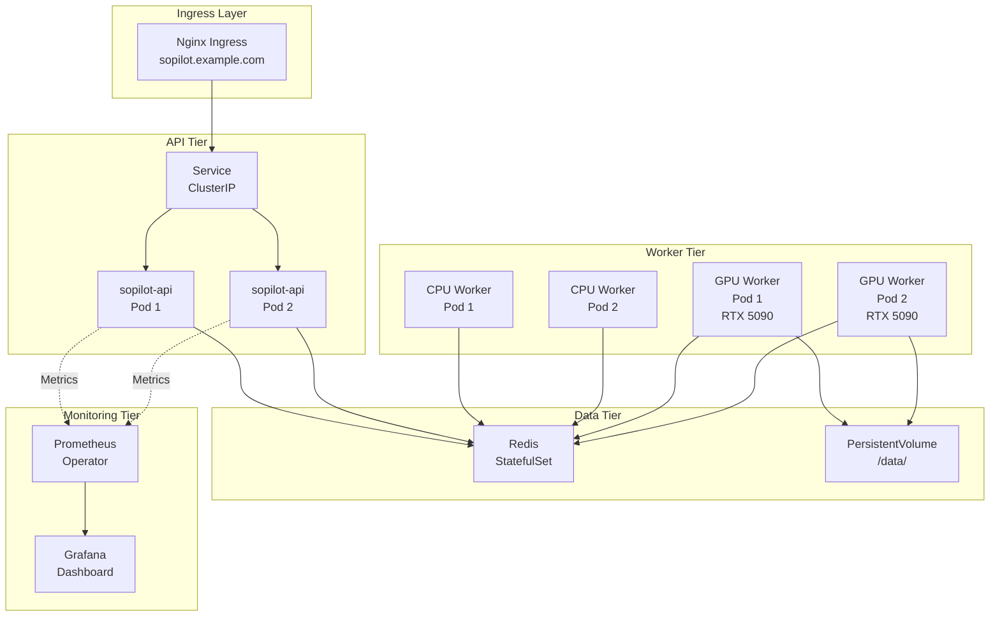

**Use Case:** Production deployments (>1000 videos/day, high availability)

**Resource Requests:**
- **API Pods:** 1 CPU, 2 GB RAM
- **CPU Workers:** 2 CPU, 4 GB RAM
- **GPU Workers:** 4 CPU, 16 GB RAM, 1 GPU
- **Redis:** 1 CPU, 2 GB RAM

---

## Security Architecture

### Authentication Flow

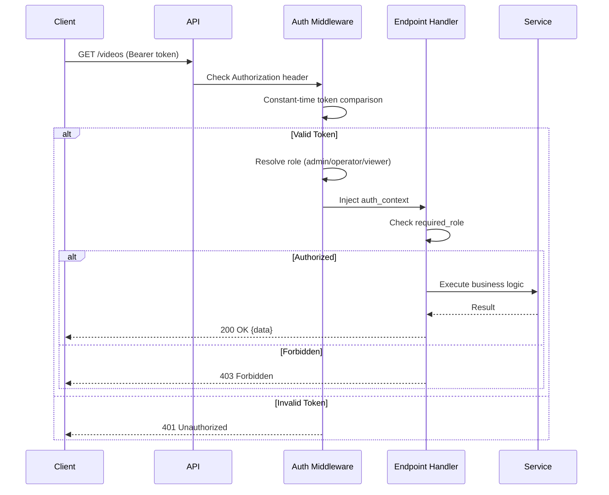

**Security Features:**
1. **Constant-Time Comparison:** Prevents timing attacks
2. **Role-Based Access Control (RBAC):** Admin > Operator > Viewer
3. **HMAC Signing:** Audit exports cryptographically signed
4. **SQL Injection Protection:** Parameterized queries only
5. **Path Traversal Prevention:** Whitelist-based file access
6. **Privacy Masking:** PII redaction (face blur, pixelate)

---

## Monitoring & Observability

### Metrics Pipeline

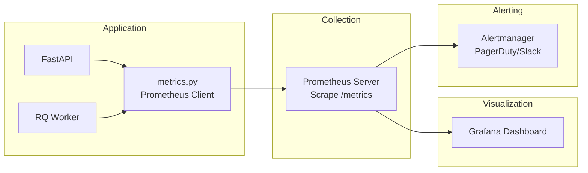

**Key Metrics:**
- **Counters:** `sopilot_ingest_jobs_total`, `sopilot_score_jobs_total`
- **Histograms:** `sopilot_job_duration_seconds`, `sopilot_dtw_execution_seconds`
- **Gauges:** `sopilot_queue_depth`, `sopilot_gpu_memory_bytes`

**Alerting Rules:**
- Queue depth >100 for >5 minutes
- Job failure rate >10%
- GPU memory >90% for >2 minutes
- API response time p95 >1s

---

## Design Principles

### 1. **Separation of Concerns**
- API layer (thin facade) → Service layer (business logic) → Data layer (persistence)
- No business logic in API handlers
- Services are testable in isolation

### 2. **Asynchronous Processing**
- Long-running tasks (ingest, score, training) delegated to workers
- API responds immediately with job ID
- Clients poll for completion

### 3. **GPU Acceleration with Fallbacks**
- All GPU code has CPU fallback paths
- Tests run without GPU (CI/CD compatible)
- Auto-detection: `is_gpu_available()` guards

### 4. **Immutable Audit Trail**
- Append-only logging
- HMAC-signed exports for tamper detection
- Compliance-ready (GDPR, HIPAA-friendly)

### 5. **Configuration as Code**
- All settings via environment variables
- Validation at startup (`Settings.__post_init__`)
- No hardcoded paths or secrets

### 6. **Observability First**
- Structured logging (JSON output)
- Prometheus metrics (all critical paths)
- Performance tracking context managers

---

## Technology Stack

| Layer | Technology | Version |
|-------|-----------|---------|
| **API** | FastAPI | 0.115+ |
| **Queue** | Redis Queue (RQ) | 1.16+ |
| **Database** | SQLite | 3.35+ |
| **ML Framework** | PyTorch | 2.5+ |
| **GPU Compute** | CuPy | 13.0+ |
| **Video Processing** | OpenCV (headless) | 4.10+ |
| **Metrics** | Prometheus Client | 0.20+ |
| **Logging** | structlog | 25.0+ |
| **Validation** | Pydantic | 2.10+ |
| **PDF Generation** | ReportLab | 4.2+ |

---

## Future Architecture Considerations

### Scalability
- **PostgreSQL Migration:** Replace SQLite for multi-writer support
- **S3 Object Storage:** Offload video files from local disk
- **Kubernetes HPA:** Auto-scale workers based on queue depth

### Performance
- **ONNX Runtime:** Export V-JEPA2 to ONNX for faster inference
- **TensorRT:** Optimize models for NVIDIA GPUs
- **Redis Caching:** Cache embeddings for frequently accessed videos

### Research Features
- **Active Learning:** Identify videos for human review (low confidence scores)
- **Multi-Task Learning:** Train adapters for multiple tasks simultaneously
- **Explainability:** Attention visualization, SHAP values

### Compliance
- **Data Retention Policies:** Auto-delete old videos after N days
- **Encryption at Rest:** Encrypt `/data/` volume
- **Audit Log Streaming:** Real-time export to SIEM (Splunk, ELK)

---

## References

- **V-JEPA2:** [facebookresearch/vjepa2](https://github.com/facebookresearch/vjepa2)
- **DTW Algorithm:** Sakoe & Chiba (1978), "Dynamic programming algorithm optimization for spoken word recognition"
- **FastAPI Documentation:** [fastapi.tiangolo.com](https://fastapi.tiangolo.com)
- **Prometheus Best Practices:** [prometheus.io/docs/practices](https://prometheus.io/docs/practices/)

---

**For deployment instructions, see:** [DEPLOYMENT_GUIDE.md](DEPLOYMENT_GUIDE.md)
**For API reference, see:** [API_REFERENCE.md](API_REFERENCE.md)
**For configuration options, see:** [CONFIGURATION.md](CONFIGURATION.md)
